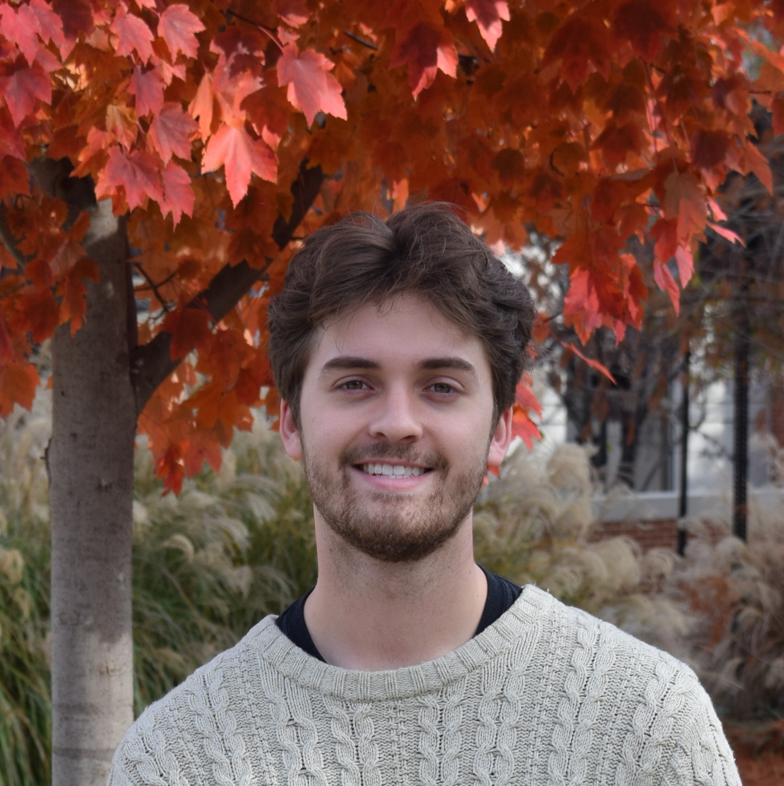

{:height="auto" width="300px"}

I'm a PhD student in the Earth, Atmospheric, and Planetary Sciences department at the Massachusetts Institute of Technology (MIT) working in the [Bosak Lab](https://www.experimentalgeobiology.mit.edu/). In the past, I have been part of the [Lloyd Lab](https://lloydlab.utk.edu/), the [Steen Lab](https://adsteen.github.io/), and the [Silva Nova project](https://www.above-belowgroundinteractions.com/silva-nova).